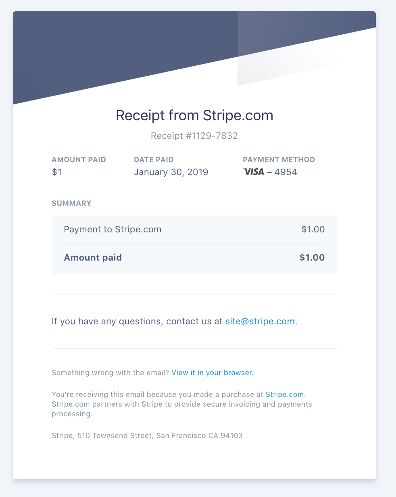

[](https://github.com/ellerbrock/open-source-badge/)
[](http://badge.fury.io/gh/boennemann%2Fbadges)

<div align="center">
    
</div>

MESG3
---

MESG3 enables easy integration of applications with Amazon S3 using this service to upload and query files from S3 Buckets.

## Supported Resources
* List Buckets `/buckets`
* List Objects in bucket `/objects`
* Upload file to bucket `/upload`
* Download file from bucket `/download`


## Dev Notes
```bash
mesg-core service deploy https://github.com/cbonoz/mesg19
```

## Example Application
* Issue and receive a payment via https://github.com/mesg-foundation/service-stripe
* Upload a receipt to Amazon S3 via MESG3 (this repo).

### Setup of Example Application

* Deploy and start the services:
<pre>
    mesg-core start
    mesg-core service deploy https://github.com/cbonoz/mesg19
    mesg-core service start SERVICE_ID # service id that was just printed after the deploy.
    mesg-core service deploy https://github.com/mesg-foundation/service-stripe
    mesg-core service start SERVICE_ID # service id that was just printed after the deploy.
</pre>

* Define the following environment TEST (or production) credentials:
<pre>
    AWS_ACCESS_TEST='YOUR_AWS_ACCESS_KEY_HERE'
    AWS_SECRET_TEST='YOUR_AWS_SECRET_KEY_HERE'
    STRIPE_API_KEY='YOUR_STRIPE_API_KEY'
</pre>
* Call the stripe test workflow. You'll need to ensure the stripe nodejs library is installed locally to simulate a payment via the script. This example shows a simple 3 step process of processing a payment, retrieving the receipt data from the stripe API, and uploading the receipt to an S3 bucket of your choosing:
<pre>
    node sample_app/stripe.js
</pre>

If successful, you should now see an image similar to the following in your s3 bucket.

<div align="center">
    h
</div>

### Tasks / Schema
* listBuckets
* listObjects
* upload
* download


<pre>
  listBuckets:
    inputs:
      region:
        description: "AWS region, ex: us-east-1"
        type: String
      accessKeyId:
        description: "Access key id for AWS user"
        type: String
      secretAccessKey:
        description: "Secret access key for AWS user"
        type: String
    outputs:
      success:
        data: &bucketData
          buckets:
            description: "List of buckets in the AWS user's region"
            type: Object
      error:
        data:
          code:
            type: String
</pre>

<pre>
  listObjects:
    inputs:
      region:
        description: "AWS region, ex: us-east-1"
        type: String
      accessKeyId:
        description: "Access key id for AWS user"
        type: String
      secretAccessKey:
        description: "Secret access key for AWS user"
        type: String
      bucket:
        description: "AWS Bucket for the query"
        type: String
    outputs:
      success:
        data: &objectData
          objects:
            description: "List of objects in the AWS user's bucket (up to 1000 items)"
            type: Object
      error:
        data:
          code:
            type: String
</pre>
<pre>
  upload:
    inputs:
      region:
        description: "AWS region, ex: us-east-1"
        type: String
      accessKeyId:
        description: "Access key id for AWS user"
        type: String
      secretAccessKey:
        description: "Secret access key for AWS user"
        type: String
      bucket:
        description: "AWS Bucket for the upload"
        type: String
      key:
        description: "Key within the bucket"
        type: String
      data:
        description: "Binary data to upload"
        type: String
    outputs:
      success:
        data: &uploadData
          result:
            description: "Upload result status"
            type: String
      error:
        data:
          code:
            type: String
</pre>
<pre>
  download:
    inputs:
      region:
        description: "AWS region, ex: us-east-1"
        type: String
      accessKeyId:
        description: "Access key id for AWS user"
        type: String
      secretAccessKey:
        description: "Secret access key for AWS user"
        type: String
      bucket:
        description: "AWS Bucket for the download"
        type: String
      key:
        description: "Key within the bucket"
        type: String
    outputs:
      success:
        data: &downloadData
          result:
            description: "Downloaded data binary"
            type: String
      error:
        data:
          code:
            type: String
</pre>

